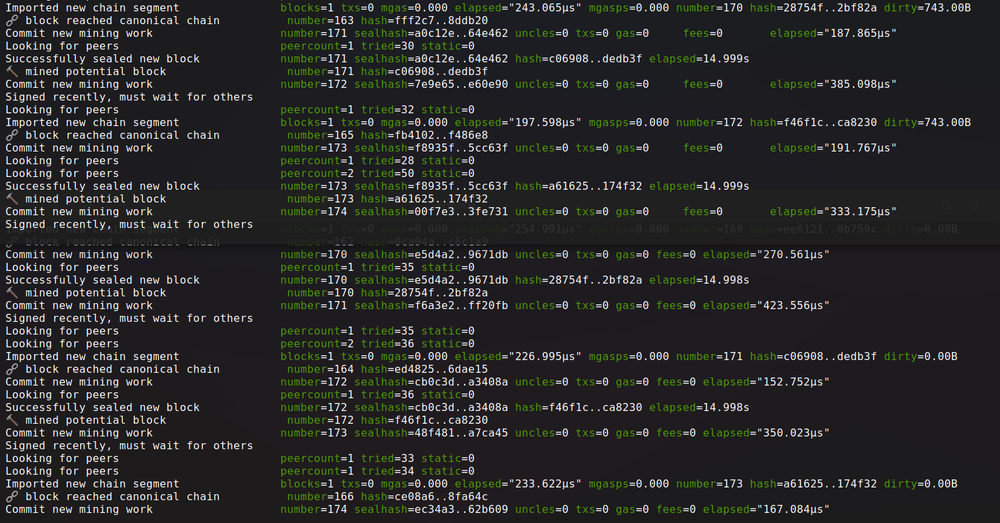

# ⛏️🔗 Building a Private Blockchain on Ethereum Protocol 🔗⛏️

You don't need to be a computer scientist or master hacker to run a blockchain network, here we walk through the procedure on a laptop running Ubuntu.  The software is free and the steps are few, *LET'S GOOOO!!!*
## Tools needed
* [Geth](https://geth.ethereum.org/docs/install-and-build/installing-geth) - 1 of 3 original implementations of the Ethereum protocol written in Go (C++ and Python are the other 2)
* [MyCrypto](https://download.mycrypto.com/) - Desktop application for maintaining Ethereum accounts

## Create nodes
* Use Geth CLI tool to create 2 nodes that will run on your blockchain network.  The password will be used when you start mining and when connecting to MyCrypto, so keep track of it.
```
geth --datadir node1 account new
geth --datadir node2 account new
```

## Create network and genesis block
* Launch the network manager tool installed that comes with Geth
```
puppeth
```


* Follow the prompts to your specifications

**Consensus Engine** - Proof-of-work or Proof-of-authority

**Chain ID** - Unique identifier of your blockchain used by MyCrypto app to connect and manage

**Blocktime** - Amount of time to mine one block

**Sealing accounts** - Account addresses of your nodes that can seal new blocks

**Prefunded accounts** - Account addresses of the nodes you want to populate with *fake cryptocurrency*

## Genesis block

## Initialize nodes on new network
* Assign nodes to newly-created blockchain
```
geth --datadir node1 init network.json
geth --datadir node2 init network.json
```
* Connect nodes to blockchain (each in its own terminal)
```
geth --datadir node1 --unlock "SEALER_ONE_ADDRESS" --mine --rpc --allow-insecure-unlock
geth --datadir node2 --unlock "SEALER_TWO_ADDRESS" --mine --port 30304 --bootnodes "enode://SEALER_ONE_ENODE_ADDRESS@127.0.0.1:30303" --ipcdisable --allow-insecure-unlock
```

* Commonly used flags:

    --datadir - Data directory for the databases and keystore

    --unlock - Comma separated list of accounts to unlock

    --mine - Enable mining

    --rpc - Enable the HTTP-RPC server (deprecated and will be removed June 2021, use --http)

    --allow-insecure-unlock - Allow insecure account unlocking when account-related RPCs are exposed by http

    --port - Network listening port (default: 30303)

    --bootnodes - Comma separated enode URLs for P2P discovery bootstrap
    
    --ipcdisable - Disable the IPC-RPC server

This is what your nodes will look like as they mine blocks



## Connect MyCrypto to new network
* Open MyCrypto app


* Connect to node using Keystore File option


## Send transaction from one node to the other
* Enter the address of your second node in the "To Address" field
* Specify the amount and click "Send Transaction" button


* Click "Check TX Status" button


* Confirm Logout


* View status


* Click "Check TX Status" button after waiting the length of time specified as blocktime


# Congratulations you are running your own private blockchain!
